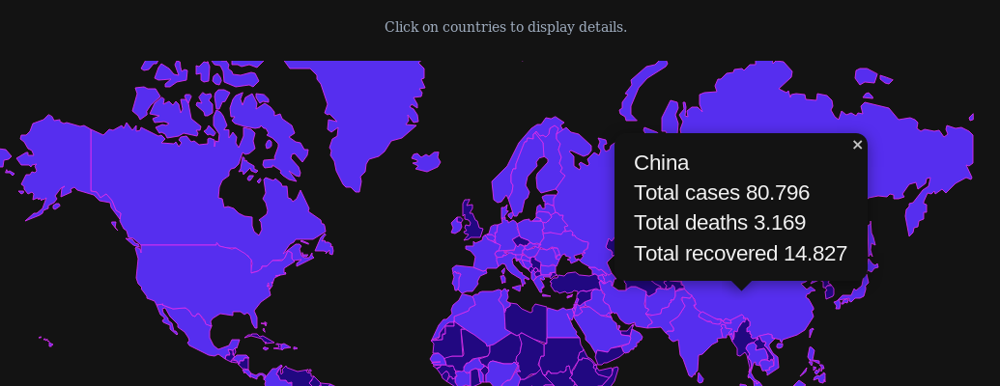

# COVID-19 Live spreading map

## Overview

This project is an example demo showcasing COVID-19 spreading across the world.

All technologies and data used are entirely publicly accessible.



### Live demo
For a live demo, see https://silly-sammet-ee1377.netlify.com/


## Core

The backend is made up of a REST api written in Python using the Flask microframework. Data comes from :SRC: making use of web scraping.


## UI

The frontend consists of a SPA built with React and uses Leaflet to display stats on an interactive map.


## Technologies used

#### Backend

* Python 3.8
* Flask microframework


#### Frontend

* React.js and React-Leaflet
* Tailwind
* Typescript

## Setup

Ensure you have Npm(>=6.9.0), Python(3.x) and Pip installed on your system and on your path.


#### Backend

```
cd core
python3 -m pip install -r requirements.txt
python3 run.py
```

#### Frontend

```
cd ui
npm install
npm start
```
